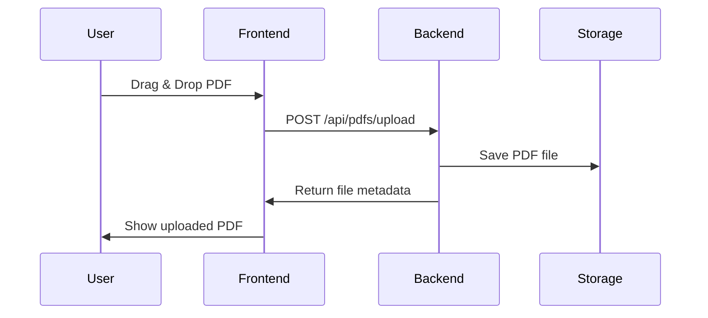
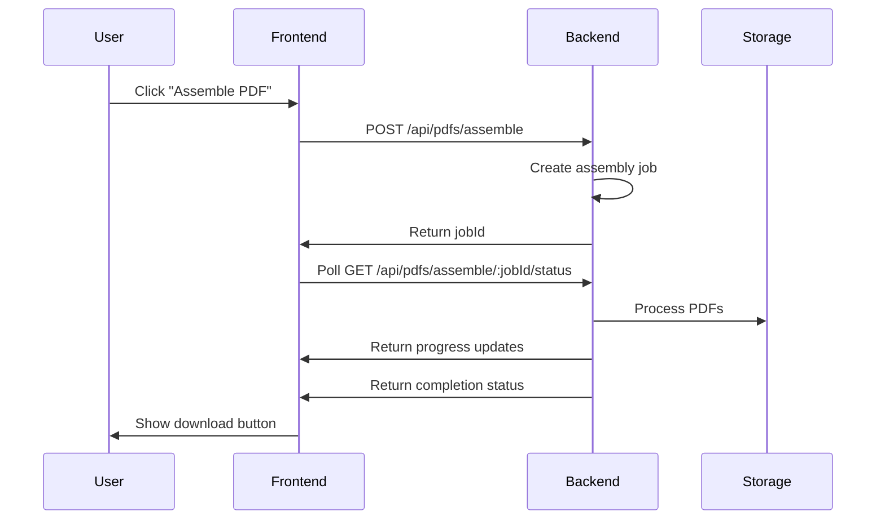

# PDF Assembly System - Complete Integration Guide

This guide explains how to integrate the React TypeScript frontend with the Node.js backend to create a complete PDF assembly system.

## 🏗️ System Architecture

```
┌─────────────────┐    HTTP/API    ┌─────────────────┐    File System    ┌─────────────────┐
│   React App     │ ◄────────────► │  Express API    │ ◄──────────────► │   PDF Storage   │
│   (Frontend)    │                │   (Backend)     │                  │   (Local/Cloud) │
│                 │                │                 │                  │                 │
│ • PDF Upload    │                │ • File Upload   │                  │ • Uploads/      │
│ • Drag & Drop   │                │ • PDF Assembly  │                  │ • Assembled/    │
│ • Assembly UI   │                │ • Job Management│                  │ • Thumbnails/   │
│ • Progress      │                │ • Status Polling│                  │                 │
└─────────────────┘                └─────────────────┘                  └─────────────────┘
```

## 🚀 Quick Start Integration

### 1. Frontend Setup

**Environment Configuration:**
```bash
# In your React project root, create .env file
echo "REACT_APP_API_BASE_URL=http://localhost:3001/api" > .env
```

**Install Dependencies:**
```bash
cd test-app
npm install
```

**Start Frontend:**
```bash
npm start
# Frontend runs on http://localhost:3000
```

### 2. Backend Setup

**Install Dependencies:**
```bash
cd backend-example
npm install
```

**Environment Configuration:**
```bash
# Create .env file in backend directory
cat > .env << EOF
PORT=3001
NODE_ENV=development
CORS_ORIGIN=http://localhost:3000
MAX_FILE_SIZE=10485760
UPLOAD_DIR=./uploads
ASSEMBLED_DIR=./assembled
EOF
```

**Start Backend:**
```bash
npm run dev
# Backend runs on http://localhost:3001
```

## 🔄 API Integration Flow

### 1. PDF Upload Process



**Frontend Implementation:**
```typescript
// src/hooks/usePDFManagement.ts
const uploadPDF = useCallback(async (file: File) => {
  try {
    const response = await pdfService.uploadPDF(file);
    if (response.success && response.file) {
      setPdfFiles(prev => [...prev, response.file!]);
    }
  } catch (error) {
    setError(`Upload failed: ${error.message}`);
  }
}, []);
```

**Backend Endpoint:**
```javascript
// server.js
app.post('/api/pdfs/upload', upload.single('pdf'), async (req, res) => {
  const fileId = uuidv4();
  const fileInfo = {
    id: fileId,
    name: req.file.originalname,
    size: req.file.size,
    uploadedAt: new Date().toISOString(),
    path: req.file.path
  };
  
  pdfFiles.set(fileId, fileInfo);
  res.json({ success: true, file: fileInfo });
});
```

### 2. PDF Assembly Process



**Frontend Implementation:**
```typescript
// src/hooks/usePDFManagement.ts
const assemblePDFs = useCallback(async () => {
  try {
    const request = {
      pdfIds: assembled.map(file => file.id),
      outputName: `assembled_${Date.now()}.pdf`
    };
    
    const response = await pdfService.assemblePDFs(request);
    setCurrentJobId(response.jobId);
    setIsAssembling(true);
  } catch (error) {
    setError(`Assembly failed: ${error.message}`);
  }
}, [assembled]);

// Poll for status updates
useEffect(() => {
  if (currentJobId && isAssembling) {
    const interval = setInterval(() => {
      checkAssemblyStatus(currentJobId);
    }, 2000);
    return () => clearInterval(interval);
  }
}, [currentJobId, isAssembling]);
```

**Backend Implementation:**
```javascript
// server.js
app.post('/api/pdfs/assemble', async (req, res) => {
  const { pdfIds, outputName } = req.body;
  const jobId = uuidv4();
  
  const job = {
    id: jobId,
    status: 'processing',
    progress: 0,
    pdfIds,
    outputName
  };
  
  jobs.set(jobId, job);
  
  // Start async assembly process
  assemblePDFs(jobId, files, outputName);
  
  res.json({
    jobId,
    status: 'processing',
    estimatedTime: files.length * 2
  });
});
```

## 🔧 Configuration Options

### Frontend Configuration

**Environment Variables:**
```env
# .env in React project root
REACT_APP_API_BASE_URL=http://localhost:3001/api
REACT_APP_MAX_FILE_SIZE=10485760
REACT_APP_POLL_INTERVAL=2000
```

**API Service Configuration:**
```typescript
// src/services/api.ts
const API_BASE_URL = process.env.REACT_APP_API_BASE_URL || 'http://localhost:3001/api';
const POLL_INTERVAL = parseInt(process.env.REACT_APP_POLL_INTERVAL || '2000');
```

### Backend Configuration

**Environment Variables:**
```env
# .env in backend directory
PORT=3001
NODE_ENV=development
CORS_ORIGIN=http://localhost:3000
MAX_FILE_SIZE=10485760
UPLOAD_DIR=./uploads
ASSEMBLED_DIR=./assembled
CLEANUP_INTERVAL=3600000
```

**File Upload Configuration:**
```javascript
// server.js
const upload = multer({
  storage,
  fileFilter: (req, file, cb) => {
    if (file.mimetype === 'application/pdf') {
      cb(null, true);
    } else {
      cb(new Error('Only PDF files are allowed'), false);
    }
  },
  limits: {
    fileSize: process.env.MAX_FILE_SIZE || 10 * 1024 * 1024
  }
});
```

## 🚀 Production Deployment

### 1. Frontend Deployment

**Build for Production:**
```bash
cd test-app
npm run build
```

**Deploy to Static Hosting:**
```bash
# Netlify
netlify deploy --prod --dir=build

# Vercel
vercel --prod

# AWS S3
aws s3 sync build/ s3://your-bucket-name
```

**Environment Configuration:**
```env
# Production .env
REACT_APP_API_BASE_URL=https://your-api-domain.com/api
```

### 2. Backend Deployment

**Docker Deployment:**
```dockerfile
# Dockerfile
FROM node:18-alpine
WORKDIR /app
COPY package*.json ./
RUN npm ci --only=production
COPY . .
EXPOSE 3001
CMD ["npm", "start"]
```

**Docker Compose:**
```yaml
# docker-compose.yml
version: '3.8'
services:
  pdf-api:
    build: ./backend-example
    ports:
      - "3001:3001"
    environment:
      - NODE_ENV=production
      - CORS_ORIGIN=https://your-frontend-domain.com
    volumes:
      - pdf-storage:/app/uploads
      - assembled-storage:/app/assembled

volumes:
  pdf-storage:
  assembled-storage:
```

**Cloud Deployment:**
```bash
# Heroku
heroku create your-pdf-assembly-api
heroku config:set NODE_ENV=production
git push heroku main

# AWS EC2
# Use PM2 for process management
pm2 start server.js --name "pdf-assembly-api"
pm2 startup
pm2 save
```

### 3. Database Integration

**Replace In-Memory Storage with Database:**
```javascript
// Using PostgreSQL with Prisma
const { PrismaClient } = require('@prisma/client');
const prisma = new PrismaClient();

// Store PDF files
const file = await prisma.pdfFile.create({
  data: {
    id: fileId,
    name: req.file.originalname,
    filename: req.file.filename,
    size: req.file.size,
    uploadedAt: new Date(),
    path: req.file.path
  }
});

// Store assembly jobs
const job = await prisma.assemblyJob.create({
  data: {
    id: jobId,
    status: 'processing',
    progress: 0,
    pdfIds: pdfIds,
    outputName: outputName,
    createdAt: new Date()
  }
});
```

### 4. Cloud Storage Integration

**AWS S3 Integration:**
```javascript
// Using AWS SDK
const AWS = require('aws-sdk');
const s3 = new AWS.S3();

// Upload PDF to S3
const uploadResult = await s3.upload({
  Bucket: process.env.S3_BUCKET,
  Key: `uploads/${fileId}/${filename}`,
  Body: fileBuffer,
  ContentType: 'application/pdf'
}).promise();

// Download from S3
const downloadResult = await s3.getObject({
  Bucket: process.env.S3_BUCKET,
  Key: `assembled/${jobId}/${outputName}`
}).promise();
```

## 🔒 Security Considerations

### 1. Authentication & Authorization

**JWT Implementation:**
```javascript
// Backend middleware
const jwt = require('jsonwebtoken');

const authenticateToken = (req, res, next) => {
  const token = req.headers['authorization']?.split(' ')[1];
  
  if (!token) {
    return res.status(401).json({ error: 'Access token required' });
  }
  
  jwt.verify(token, process.env.JWT_SECRET, (err, user) => {
    if (err) return res.status(403).json({ error: 'Invalid token' });
    req.user = user;
    next();
  });
};

// Apply to protected routes
app.post('/api/pdfs/upload', authenticateToken, upload.single('pdf'), ...);
```

**Frontend Integration:**
```typescript
// src/services/api.ts
const getAuthHeaders = () => {
  const token = localStorage.getItem('authToken');
  return token ? { Authorization: `Bearer ${token}` } : {};
};

const request = async (endpoint: string, options: RequestInit = {}) => {
  const config = {
    headers: {
      'Content-Type': 'application/json',
      ...getAuthHeaders(),
      ...options.headers,
    },
    ...options,
  };
  // ... rest of request logic
};
```

### 2. Rate Limiting

**Backend Implementation:**
```javascript
const rateLimit = require('express-rate-limit');

const uploadLimiter = rateLimit({
  windowMs: 15 * 60 * 1000, // 15 minutes
  max: 10, // limit each IP to 10 uploads per windowMs
  message: 'Too many uploads from this IP'
});

app.post('/api/pdfs/upload', uploadLimiter, upload.single('pdf'), ...);
```

### 3. File Validation

**Enhanced Validation:**
```javascript
const validatePDF = async (filePath) => {
  try {
    const pdfBytes = await fs.readFile(filePath);
    const pdf = await PDFDocument.load(pdfBytes);
    
    // Check for malicious content
    const pages = pdf.getPages();
    if (pages.length > 100) {
      throw new Error('PDF too large (max 100 pages)');
    }
    
    return true;
  } catch (error) {
    throw new Error('Invalid PDF file');
  }
};
```

## 📊 Monitoring & Logging

### 1. Application Monitoring

**Winston Logging:**
```javascript
const winston = require('winston');

const logger = winston.createLogger({
  level: 'info',
  format: winston.format.combine(
    winston.format.timestamp(),
    winston.format.json()
  ),
  transports: [
    new winston.transports.File({ filename: 'error.log', level: 'error' }),
    new winston.transports.File({ filename: 'combined.log' })
  ]
});

// Log API requests
app.use((req, res, next) => {
  logger.info(`${req.method} ${req.path}`, {
    ip: req.ip,
    userAgent: req.get('User-Agent')
  });
  next();
});
```

### 2. Health Checks

**Backend Health Endpoint:**
```javascript
app.get('/health', (req, res) => {
  res.json({
    status: 'healthy',
    timestamp: new Date().toISOString(),
    uptime: process.uptime(),
    memory: process.memoryUsage(),
    version: process.env.npm_package_version
  });
});
```

## 🧪 Testing

### 1. API Testing

**Jest Test Suite:**
```javascript
// __tests__/api.test.js
const request = require('supertest');
const app = require('../server');

describe('PDF API', () => {
  test('should upload PDF file', async () => {
    const response = await request(app)
      .post('/api/pdfs/upload')
      .attach('pdf', 'test-files/sample.pdf');
    
    expect(response.status).toBe(200);
    expect(response.body.success).toBe(true);
  });
  
  test('should assemble PDFs', async () => {
    const response = await request(app)
      .post('/api/pdfs/assemble')
      .send({
        pdfIds: ['uuid1', 'uuid2'],
        outputName: 'test-assembly.pdf'
      });
    
    expect(response.status).toBe(200);
    expect(response.body.jobId).toBeDefined();
  });
});
```

### 2. Frontend Testing

**React Testing Library:**
```typescript
// src/components/__tests__/PDFUpload.test.tsx
import { render, fireEvent, waitFor } from '@testing-library/react';
import { PDFUpload } from '../PDFUpload';

test('should handle file upload', async () => {
  const mockUpload = jest.fn();
  const { getByText } = render(<PDFUpload onUpload={mockUpload} />);
  
  const file = new File(['pdf content'], 'test.pdf', { type: 'application/pdf' });
  const input = document.querySelector('input[type="file"]');
  
  fireEvent.change(input!, { target: { files: [file] } });
  
  await waitFor(() => {
    expect(mockUpload).toHaveBeenCalledWith(file);
  });
});
```

## 🔧 Troubleshooting

### Common Issues & Solutions

1. **CORS Errors**
   ```javascript
   // Backend: Ensure CORS is configured correctly
   app.use(cors({
     origin: process.env.CORS_ORIGIN || 'http://localhost:3000',
     credentials: true
   }));
   ```

2. **File Upload Failures**
   ```javascript
   // Check file size and type validation
   const upload = multer({
     limits: { fileSize: 10 * 1024 * 1024 }, // 10MB
     fileFilter: (req, file, cb) => {
       if (file.mimetype === 'application/pdf') {
         cb(null, true);
       } else {
         cb(new Error('Only PDF files allowed'));
       }
     }
   });
   ```

3. **Assembly Job Failures**
   ```javascript
   // Add proper error handling in assembly function
   async function assemblePDFs(jobId, files, outputName) {
     try {
       // ... assembly logic
     } catch (error) {
       console.error('Assembly failed:', error);
       job.status = 'failed';
       job.error = error.message;
       jobs.set(jobId, job);
     }
   }
   ```

## 📈 Performance Optimization

### 1. Frontend Optimizations

**Lazy Loading:**
```typescript
// Lazy load components
const PDFUpload = React.lazy(() => import('./components/PDFUpload'));
const AssemblyPanel = React.lazy(() => import('./components/AssemblyPanel'));

// Use Suspense
<Suspense fallback={<div>Loading...</div>}>
  <PDFUpload onUpload={uploadPDF} />
</Suspense>
```

**Memoization:**
```typescript
// Memoize expensive operations
const memoizedAssemble = useMemo(() => {
  return assembled.length > 0 ? assemblePDFs : null;
}, [assembled]);

// Use React.memo for components
const PDFTile = React.memo(({ tile, onDelete }) => {
  // Component logic
});
```

### 2. Backend Optimizations

**Streaming for Large Files:**
```javascript
// Stream PDF processing
const stream = require('stream');
const { pipeline } = require('stream/promises');

app.get('/api/pdfs/:id/download', async (req, res) => {
  const file = await getFile(req.params.id);
  const fileStream = fs.createReadStream(file.path);
  
  res.setHeader('Content-Type', 'application/pdf');
  res.setHeader('Content-Disposition', `attachment; filename="${file.name}"`);
  
  await pipeline(fileStream, res);
});
```

**Caching:**
```javascript
// Redis caching for thumbnails
const redis = require('redis');
const client = redis.createClient();

app.get('/api/pdfs/:id/thumbnail', async (req, res) => {
  const cacheKey = `thumbnail:${req.params.id}`;
  const cached = await client.get(cacheKey);
  
  if (cached) {
    res.setHeader('Content-Type', 'application/pdf');
    res.send(Buffer.from(cached, 'base64'));
    return;
  }
  
  // Generate thumbnail and cache
  const thumbnail = await generateThumbnail(req.params.id);
  await client.setex(cacheKey, 3600, thumbnail.toString('base64'));
  res.send(thumbnail);
});
```

This integration guide provides a complete roadmap for connecting your React frontend with a Node.js backend to create a production-ready PDF assembly system. The system is scalable, secure, and can be deployed to various cloud platforms.
